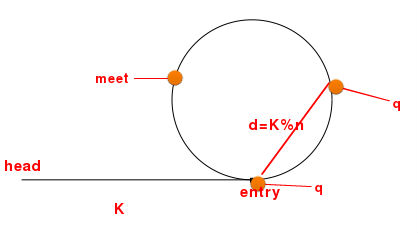

# 链表的各种题目整理(C语言实现)(Simple and Brief) #

这里处理的全部是单链表:

```c
typedef struct node {
	char *data; 
	struct node *next; 
} node_t;
```

我们约定一个打印链表的函数:

```c
void list_display(node_t *head)
{
	for (; head; head = head->next)
		printf("%s ", head->data);
	printf("\n");
}
```

下面是几个常见的链表笔面问题:

[TOC]

## 1.计算链表长度

很简单:(复杂度O(n))
```c
int list_len(node_t *head)
{
	int i; 
	for (i = 0; head; head = head->next, i++); 
	return i; 
}
```
测试:
```
int main(int argc, const char *argv[])
{
	node_t d = {"d", 0}, c = {"c", &d}, b = {"b", &c}, a = {"a", &b}; 
	printf("%d\n", list_len(&a));//4
	return 0;
}
```

## 2.反转链表

我们多用几个指针就可以在O(n)完成反转任务:

算法:t遍历链表, q记录t的上一个结点, p是一个临时变量用来缓存t的值
```c
void reverse(node_t *head)
{
	node_t *p = 0, *q = 0, *t = 0; 
	for (t = head; t; p = t, t = t->next, p->next = q, q = p); 
}
```
测试:
```c
node_t d = {"d", 0}, c = {"c", &d}, b = {"b", &c}, a = {"a", &b}; 
list_display(&a); 
reverse(&a); 
list_display(&d); 
```

## 3.查找倒数第k个元素(尾结点记为倒数第0个)

算法:2个指针p, q初始化指向头结点.p先跑到k结点处, 然后q再开始跑, 当p跑到最后跑到尾巴时, q正好到达倒数第k个.复杂度O(n)

```c
node_t *_kth(node_t *head, int k)
{
	int i = 0; 
	node_t *p = head, *q = head; 
	for (; p && i < k; p = p->next, i++); 
	if (i < k) return 0;
	for (; p->next; p = p->next, q = q->next); 
	return q; 
}
```
测试:
```c
node_t d = {"d", 0}, c = {"c", &d}, b = {"b", &c}, a = {"a", &b}; 
printf("_0 :%s _1: %s _2:%s _3:%s\n", _kth(&a, 0)->data, _kth(&a, 1)->data, _kth(&a, 2)->data, _kth(&a, 3)->data);
```
输出:
```
_0 :d _1: c _2:b _3:a
```
## 4.查找中间结点 

找出中间的那个结点

算法:设两个初始化指向头结点的指针p, q.p每次前进两个结点, q每次前进一个结点, 这样当p到达链表尾巴的时候, q到达了中间.复杂度O(n)

```c
node_t *middle(node_t *head)
{
	node_t *p, *q; 
	for (p = q = head; p->next; p = p->next, q = q->next){
		p = p->next; 
		if (!(p->next)) break; 
	}
	return q; 
}
```

测试:

```
node_t e = {"e", 0}, d = {"d", &e}, c = {"c", &d}, b = {"b", &c}, a = {"a", &b}; 
printf("%s\n", middle(&a)->data);
```

## 5.逆序打印链表

给你链表的头结点, 逆序打印这个链表.使用递归(即让系统使用栈), 时间复杂度O(n)

```c
void r_display(node_t *t)
{
	if (t){
		r_display(t->next); 
		printf("%s", t->data);
	}
}
```

## 6.判断一个链表是否有环

如果一个链表有环, 那么它肯定只有一个环.(一个相交结点)

算法:设两个指针p, q, 初始化指向头.p以步长2的速度向前跑, q的步长是1.这样, 如果链表不存在环, p和q肯定不会相遇.如果存在环, p和q一定会相遇.(就像两个速度不同的汽车在一个环上跑绝对会相遇).复杂度O(n)

```c
int any_ring(node_t *head)
{
	node_t *p, *q; 
	for (p = q = head;p; p = p->next, q = q->next){
		p = p->next; 
		if (!p) break; 
		if (p == q) return 1; //yes
	}
	return 0; //fail find
}
```
测试:
```
node_t e = {"e", 0}, d = {"d", &e}, c = {"c", &d}, b = {"b", &c}, a = {"a", &b}; 
e.next = &a; 
printf("%d\n", any_ring(&a));
```

## 7.找出链表中环的入口结点



还是使用俩指针p和q, p扫描的步长为1, q扫描的步长为2.它们的相遇点为图中meet处(在环上).

假设头指针head到入口点entry之间的距离是K.则当q入环的时候, p已经领先了q为: d = K%n(n为环的周长).

我们设meet处相对entry的距离(沿行进方向)为x, 则有

(n-d)+x = 2x   (p行进的路程是q的两倍)

解得x = n-d

那么当p和q在meet处相遇的时候, 从head处再发出一个步长为1的指针r, 可以知道, r和q会在entry处相遇!

算法就是:

```
初始化三个指针p, q, r全部指向head. 然后p以2的速度行进, q以1的速度行进.当p和q相遇的时候, 发出r指针并以1的速度行进, 当p和r相遇返回这个结点.复杂度O(n)
```

代码:
```c
node_t *find_entry(node_t *head)
{
	node_t *p, *q, *r; 
	
	for (p = q = head; p; p = p->next, q = q->next){
		p = p->next; 
		if (!p) break; 
		if (p == q) break; 
	}
	
	if (!p) return 0; //no ring in list
	
	for (r = head, q = q->next; q != r; r = r->next, q = q->next); 
	
	return r; 
}
```
测试:
```c
node_t e = {"e", 0}, d = {"d", &e}, c = {"c", &d}, b = {"b", &c}, a = {"a", &b}; 
e.next = &d; 
printf("%s\n", find_entry(&a)->data);
```

## 8.判断两个单链表是否相交

算法:两个指针遍历这两个链表,如果他们的尾结点相同,则必定相交.复杂度O(m+n)

代码实现:

```c
int is_intersect(node_t *a, node_t *b)
{
	if (!a || !b) return -1; //a or b is NULL
	for (; a->next; a = a->next); 
	for (; b->next; b = b->next); 
	return a == b?1:0; //return 1 for yes, 0 for no
}
```

测试代码 :

```c
node_t e = {"e", 0}, d = {"d", &e}, c = {"c", &d}, b = {"b", &c}, a = {"a", &b}; 
node_t z = {"z", &c}, y = {"y", &z}, x = {"x", &y}; 
printf("%d\n", is_intersect(&a, &x));
```

## 9.找两个链表相交的交点

假设两个链表a,b.a比b长k个结点(k>=0).

那么当a_ptr,b_ptr两个指针同时分别遍历a,b的时候, 必然b_ptr先到达结尾(NULL),而此时a_ptr落后a的尾巴k个结点.

如果此时再从a的头发出一个指针t,继续和a_ptr 一起走,当a_ptr达到结尾(NULL)时,t恰好走了k个结点.此时从b的头发一个指针s, s和t一起走,因为a比b长k个结点,所以,t和s会一起到达交点.

算法便是:
```
p,q分别遍历链表a,b,假设q先到达NULL,此时从a的头发出一个指针t,当p到达NULL时,从b的头发出s,当s==t的时候即交点.
```

代码实现:
(注,当a,b不相交,函数返回0,即相交在NULL)
```c
node_t *intersect_point(node_t *a, node_t *b)
{
	node_t *p, *q, *k, *t, *s; 
	for (p = a, q = b; p && q; p = p->next, q = q->next); 
	
	k = (p == 0)?q:p; //k record the pointer not NULL
	t = (p == 0)?b:a; //if p arrive at tail first, t = b ; else p = a
	s = (p == 0)?a:b; 
	for (; k; k = k->next, t = t->next); 
	for (; t != s; t = t->next, s = s->next); 
	return t; 
}
```
测试
```c
node_t e = {"e", 0}, d = {"d", &e}, c = {"c", &d}, b = {"b", &c}, a = {"a", &b}; 
node_t z = {"z", &b}, y = {"y", &z}, x = {"x", &y}; 
printf("%s\n", intersect_point(&a, &x)->data);
```

## 10.O(1)删除结点(不给头结点)

其实我很反对这个做法.

不给头结点的时候怎么删除一个结点d:
```
把d的下一个结点e的数据拷贝到d中,然后删除e
```
我认为这是个伪删除,并且这个算法无法处理d是最后一个结点的情况

代码实现:

```c
node_t *delete(node_t *d) 
{
	node_t *e = d->next; 
	d->data = e->data; 
	d->next = e->next; 
}
```

## 11.两个链表右对齐打印

为了打印的整齐性,我们把结点存储的数据类型改为int(我们存放数字)

比如两个链表`1->2->3->4->5`和`6->7->8`,我们想要打印这种效果:

```
1 2 3 4 5 
    6 7 8 
```

算法:

```
p和q两个指针分别遍历链表a和b,假如q先到达0(即a比b长),此时由a头发出t,打印完链表a.
p继续移动到0,并打印空格.
从b头发出指针s打印链表b
```

代码:
```c
void foo(node_t *a, node_t *b)
{
	node_t *p, *q, *k, *t, *s; 
	for (p = a, q = b; p && q; p = p->next, q = q->next); 

	k = p?p:q; 
	t = p?a:b; 
	s = p?b:a; 
	
	for (; t; printf("%d ", t->data), t = t->next); 
	printf("\n");
	for (; k; printf("  "), k = k->next); 
	for (; s; printf("%d ", s->data), s = s->next); 
}
```

测试:

```c
node_t e = {5, 0}, d = {4, &e}, c = {3, &d}, b = {2, &c}, a = {1, &b}; 
node_t  o = {8, 0}, n = {7, &o}, m = {6, &n}; 
foo(&a, &m); 
```
